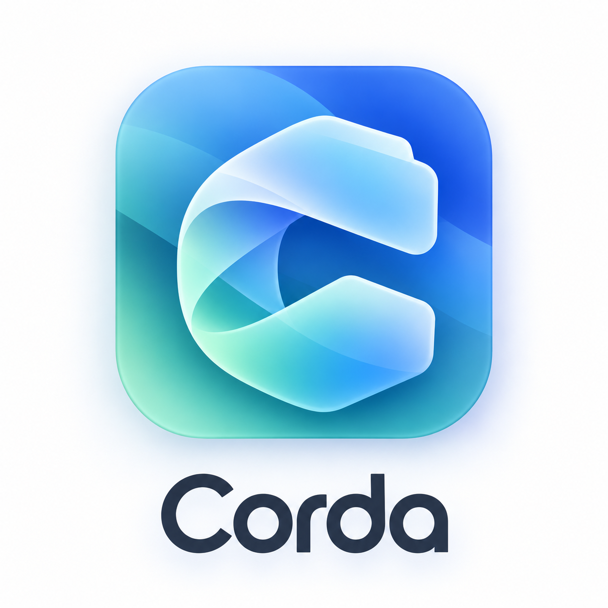
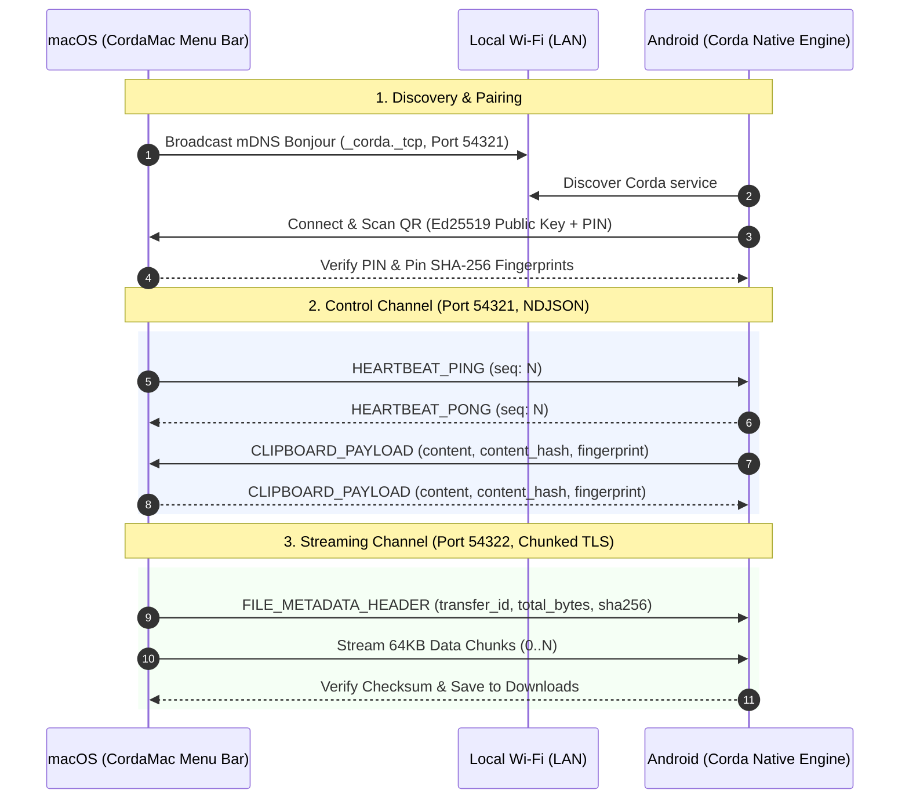

<p align="center">
  
</p>

<p align="center">
  <strong>The invisible cord between your Mac and Android.</strong><br/>
  Universal background clipboard synchronization and ultra-fast, encrypted local file sharing with Apple Continuity-grade seamlessness.
</p>

<p align="center">
  <a href="https://github.com/moonetics/Corda/releases"></a>
  <a href="LICENSE"></a>
  
  
  
  
</p>

---

## ⚡ Overview

Apple Continuity provides one of the best ecosystem experiences in computing, but leaves Android devices out in the cold. Existing third-party bridges often compromise on privacy by routing data through remote cloud servers, require constant app switching to sync clipboards, or fail on modern Android background execution restrictions.

**Corda** bridges the gap natively:
- **Instant, Zero-Click Clipboard Sync**: Copy text on your Mac, and it is instantly on your Android clipboard. Copy text or credentials on Android (including inside apps with dedicated "Copy" buttons like password managers or shopping apps), and it synchronizes immediately to your Mac menu bar without opening the Corda app.
- **High-Speed Direct File Streaming**: Move photos, 4K videos, APKs, or documents over your local Wi-Fi at gigabit speeds via chunked TLS streams with zero file size restrictions.
- **Zero Cloud, 100% Local**: No user accounts, no remote relay servers, and zero telemetry. Everything operates peer-to-peer on your local network, secured by cryptographically bound hardware keys.

---

## ✨ Key Features

### 📋 Universal Background Clipboard Sync
* **Bi-directional & Instantaneous**: Typical transfer latency is under 50ms over standard Wi-Fi.
* **True Android Background Sync**: Works even when your phone is locked or in another application. Corda integrates an advanced native Android Accessibility Sniffer and direct BAL-exempt bridge that captures:
  - Standard text selection copies (`Ctrl+C` or popup menus)
  - Keyboard pasteboard interactions (Gboard, Samsung Keyboard)
  - Custom in-app copy buttons (password managers, banking apps, Seakun, etc.)
  - Toast and snackbar copy notifications
* **Echo Suppression**: SHA-256 content deduplication prevents infinite feedback loops between synchronized devices.

### 📁 High-Speed Encrypted File Streaming
* **Local Peer-to-Peer Pipeline**: Streams data directly over port `54322` using 64KB TLS-encrypted chunks.
* **Zero Compression & No Size Limits**: Send raw camera images, ISOs, or multi-gigabyte video files without compression or loss of metadata.
* **Integrity Verified**: Every file transfer is validated end-to-end with SHA-256 checksums before committing to disk.

### 🔐 Hardware-Pinned Security
* **Mutual Authentication**: Pairing uses a 6-digit one-time PIN and QR code exchange to establish mutual trust between public keys.
* **In-Band Fingerprint Validation**: All incoming clipboard and file payloads are checked against stored hardware key fingerprints. Unknown senders are rejected instantly.
* **Zero External Dependencies**: Operates entirely offline on your local LAN.

### 🎨 Native Platform Ergonomics
* **macOS Menu Bar App (`CordaMac`)**: Written in 100% pure Swift and SwiftUI. Lives quietly in your menu bar with recent clipboard history, device status, and drag-and-drop file targets.
* **Android Client**: Crafted with Flutter and native Kotlin, featuring clean Apple-grade typography, responsive layout, Quick Settings tile support, and full-bleed adaptive icons.

---

## 🏗️ Architecture & Protocols

Corda utilizes a dual-channel socket architecture over the local network:



### Communication Channels
1. **Control Channel (`Port 54321`)**: Persistent TCP socket streaming NDJSON frames for device pairing, real-time clipboard updates, and heartbeat pings.
2. **Data Streaming Channel (`Port 54322`)**: Dedicated high-throughput TLS socket for binary file transfers, segmented into verified 64KB chunks.
3. **Local Discovery**: Zero-configuration discovery using Apple Bonjour / Android mDNS (`_corda._tcp.local.`).

---

## 📂 Repository Structure

```
.
├── Makefile                # Unified build, test, and installation orchestration
├── protocol/               # Protocol specification & JSON Schema
│   └── control_messages.json
├── macos/                  # Native macOS Menu Bar Application (Swift / SwiftUI)
│   ├── Package.swift
│   └── CordaMac/
│       ├── App/            # Entry point & App lifecycle
│       ├── Network/        # ControlSessionServer & DataStreamServer
│       ├── UI/             # MenuBarPopupView & PairingWindowController
│       └── Resources/      # Assets, AppIcon.icns & launch metadata
├── android/                # Android Mobile Application (Flutter + Kotlin)
│   ├── pubspec.yaml
│   ├── lib/                # Flutter UI, Screens & State Management
│   └── android/app/src/main/kotlin/com/corda/app/
│       ├── accessibility/  # ClipboardAccessibilityService (universal copy sniffer)
│       ├── actions/        # TransparentActivity & Quick Settings Tile
│       ├── network/        # ControlSocketClient & FileDataStreamClient
│       └── services/       # CordaForegroundService
├── scripts/                # Verification, benchmarks & icon generators
│   ├── validate_schemas.py
│   ├── test_phase4_clipboard.py
│   ├── test_phase5_file_streaming.py
│   ├── test_phase6_reliability.py
│   └── test_phase7_acceptance_benchmarks.py
└── docs/                   # Architectural decisions and release notes
```

---

## 🚀 Quick Start & Installation

### Prerequisites
* **macOS**: macOS 14.0 (Sonoma) or macOS 15.0+ (Sequoia) with Xcode command-line tools.
* **Android**: Android 10.0 (API Level 29) or higher.
* **Toolchains**: Swift 5.9+, Flutter 3.19+, JDK 17+.

Check your local environment using the included Makefile:
```bash
make check
```

---

### 1. Build & Install macOS Application
To compile the native release binary and install Corda directly into `/Applications`:

```bash
# Build, bundle, and install into /Applications/Corda.app
make install-mac

# Or run directly in debug mode from menu bar
make run-mac
```

When first launched, click the Corda icon in your menu bar and select **Pair New Device**. A QR code containing the pairing token and one-time PIN will appear.

---

### 2. Build & Install Android Application
Connect your Android phone via USB with USB Debugging enabled, then:

```bash
# Build Flutter release APK and install to connected device
make install-android
```

Alternatively, build the APK file standalone:
```bash
make bundle-android
# APK will be located at build/Corda-Android.apk
```

---

### 3. Pairing & Permissions

1. Open **Corda** on your Android device.
2. Tap **Pair Device** and scan the QR code displayed by Corda on your Mac menu bar.
3. Grant the required permissions:
   - **Accessibility Service**: Required to monitor clipboard copy actions in the background across all apps (Gboard, browser, password managers, and in-app copy buttons).
   - **Battery Optimization (Unrestricted)**: Recommended to prevent Android from terminating the background sync service during deep doze.
   - **Local Network**: Required by macOS to accept connections from Android over Wi-Fi.

Once paired, the connection status in your Mac menu bar will turn green (**Connected**).

---

## 🧪 Testing & Verification

Corda comes with an extensive suite of automated validators and benchmarks:

```bash
# 1. Validate JSON schema definitions for all control messages
make test-protocol

# 2. Compile and verify cryptographic modules on both platforms
make test-crypto

# 3. Run end-to-end acceptance benchmarks
python3 scripts/test_phase7_acceptance_benchmarks.py
```

---

## 🔒 Security & Privacy

Corda is designed with privacy as a foundational requirement:

* **Zero Cloud Dependence**: No traffic ever leaves your local Wi-Fi subnet.
* **Key Generation & Storage**: Cryptographic key pairs are generated on-device and stored securely in macOS Keychain and Android Keystore.
* **Mutual Trust Verification**: Devices only accept control messages and file transfers from explicitly paired public key fingerprints.
* **No Clipboard Snooping**: Android accessibility sniffing only reads text immediately following user-initiated copy events or explicit copy button actions.

---

## 🤝 Contributing

Contributions, bug reports, and suggestions are welcome! Please check out [CONTRIBUTING.md](CONTRIBUTING.md) for local development workflows and code conventions.

---

## 📄 License

This project is licensed under the MIT License - see the [LICENSE](LICENSE) file for details.

---

<p align="center">
  Crafted with care by <a href="https://github.com/moonetics">Moonetics</a>.
</p>
