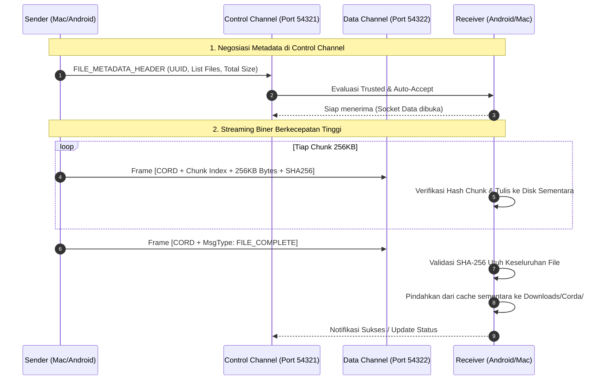

# Corda High-Speed Binary Streaming Protocol Specification
**Channel:** Data Stream Channel (Port 54322)  
**Security:** TLS 1.3 End-to-End Encrypted  
**Byte Order:** Network Byte Order (Big-Endian)  
**Chunk Size:** Up to 262,144 bytes (256 KB)  

---

## 1. Frame Layout & Field Breakdown

Setiap paket biner yang dikirim melalui Data Stream Channel dibungkus dengan header terstruktur sebagai berikut:

```text
 0                   1                   2                   3
 0 1 2 3 4 5 6 7 8 9 0 1 2 3 4 5 6 7 8 9 0 1 2 3 4 5 6 7 8 9 0 1
+-+-+-+-+-+-+-+-+-+-+-+-+-+-+-+-+-+-+-+-+-+-+-+-+-+-+-+-+-+-+-+-+
|                      Magic Bytes ('CORD')                     | 0x434F5244 (4 bytes)
+-+-+-+-+-+-+-+-+-+-+-+-+-+-+-+-+-+-+-+-+-+-+-+-+-+-+-+-+-+-+-+-+
|  Version (1B) | Msg Type (1B) |           Reserved (2B)       | (4 bytes)
+-+-+-+-+-+-+-+-+-+-+-+-+-+-+-+-+-+-+-+-+-+-+-+-+-+-+-+-+-+-+-+-+
|                                                               |
+                                                               +
|                     Transfer UUID (16 Bytes)                  |
+                                                               +
|                                                               |
+-+-+-+-+-+-+-+-+-+-+-+-+-+-+-+-+-+-+-+-+-+-+-+-+-+-+-+-+-+-+-+-+
|                     File Index (4 Bytes, UInt32)              | 0-indexed file in manifest
+-+-+-+-+-+-+-+-+-+-+-+-+-+-+-+-+-+-+-+-+-+-+-+-+-+-+-+-+-+-+-+-+
|                    Chunk Index (4 Bytes, UInt32)              | 0-indexed chunk in file
+-+-+-+-+-+-+-+-+-+-+-+-+-+-+-+-+-+-+-+-+-+-+-+-+-+-+-+-+-+-+-+-+
|                    Total Chunks (4 Bytes, UInt32)             | Total chunks in file
+-+-+-+-+-+-+-+-+-+-+-+-+-+-+-+-+-+-+-+-+-+-+-+-+-+-+-+-+-+-+-+-+
|                   Payload Length N (4 Bytes, UInt32)          | 0 to 262,144 bytes
+-+-+-+-+-+-+-+-+-+-+-+-+-+-+-+-+-+-+-+-+-+-+-+-+-+-+-+-+-+-+-+-+
|                                                               |
|                   Raw Payload Data (N Bytes)                  |
|                                                               |
+-+-+-+-+-+-+-+-+-+-+-+-+-+-+-+-+-+-+-+-+-+-+-+-+-+-+-+-+-+-+-+-+
|                                                               |
+                                                               +
|                   SHA-256 Checksum (32 Bytes)                 | Hash dari Raw Payload Data
+                                                               +
|                                                               |
+-+-+-+-+-+-+-+-+-+-+-+-+-+-+-+-+-+-+-+-+-+-+-+-+-+-+-+-+-+-+-+-+
```

---

## 2. Definisi Header Fields

1. **Magic Bytes (4 Bytes)**: `0x43 0x4F 0x52 0x44` (ASCII karakter `"CORD"`). Berfungsi memastikan stream receiver tersinkronisasi pada batas frame yang valid.
2. **Version (1 Byte)**: Versi protokol biner. Default: `0x01`.
3. **Message Type (1 Byte)**:
   - `0x01` = `CHUNK_DATA` (Membawa bagian data file).
   - `0x02` = `FILE_COMPLETE` (Menandakan satu file selesai ditransfer).
   - `0x03` = `TRANSFER_COMPLETE` (Menandakan seluruh batch file selesai).
   - `0x04` = `CHUNK_ACK` (Konfirmasi penerimaan dari receiver).
   - `0xFF` = `TRANSFER_ABORT` (Pembatalan mendadak / error fatal).
4. **Reserved (2 Bytes)**: Dialokasikan untuk flag kompresi masa depan (cth: zstd/lz4). Default: `0x0000`.
5. **Transfer UUID (16 Bytes)**: Nilai biner 128-bit dari UUID v4 transaksi transfer (sesuai yang diumumkan di `FILE_METADATA_HEADER` pada Control Channel).
6. **File Index (4 Bytes, UInt32BE)**: Indeks nomor file dalam manifest transfer (0-indexed).
7. **Chunk Index (4 Bytes, UInt32BE)**: Nomor urut chunk untuk file yang sedang dikirim (mulai dari `0` hingga `Total Chunks - 1`).
8. **Total Chunks (4 Bytes, UInt32BE)**: Jumlah total chunk yang dibutuhkan untuk file ini:  
   $$\text{Total Chunks} = \lceil \text{File Size} / 262144 \rceil$$
9. **Payload Length (4 Bytes, UInt32BE)**: Panjang payload biner dalam bytes ($N \le 262144$).
10. **Raw Payload Data ($N$ Bytes)**: Biner murni file yang dibaca dari disk pengirim.
11. **SHA-256 Checksum (32 Bytes)**: Hash SHA-256 biner dari `$N$ Bytes Payload Data` untuk memvalidasi integritas per chunk secara *fail-fast* sebelum ditulis ke penyimpanan sementara.

---

## 3. Alur Koordinasi Dua Saluran (Control + Data)



---

## 4. Keunggulan Arsitektur Ini
- **Zero Head-of-line Blocking**: Sinkronisasi clipboard di Port 54321 tetap instan (< 200ms) saat file berukuran 10 GB mengalir di Port 54322.
- **Fail-Fast Integrity**: Setiap chunk divalidasi dengan checksum mandiri 32-byte, sehingga korupsi data langsung terdeteksi seketika tanpa harus menunggu 10 GB selesai.
- **Memory Footprint Terkendali**: Pengirim dan penerima hanya mengalokasikan buffer memori tetap sebesar 256 KB di RAM, tidak membebani perangkat berspesifikasi hemat daya.
